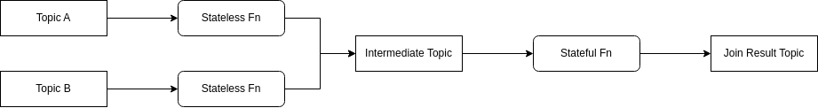

# Platform

Async LLM / AI platform.

Generally a way to avoid synchronous function calls by splitting out tool and model eval into message handlers.
Some of the packages can be used independently:

- agent: general harness and tools built around OpenAI compatible endpoint and MCP sdk
- flow: simplifies implementation of async functions
- format: a collection of ways to convert to and from byte array and to mask and unmask / encrypt and decrypt byte array
- reflect: a way to safely convert to and from types
- web: simplifies the way to register pages, also serves as an example on how to build a good enough backend rendered UI with interactions via HTMX and design via web components

## Developing

### Tools Used

Please follow the tools setup guide in its respective repository or documentation.

- Golang
- Gomock
- Podman / docker
- Protoc
- Protoc-gen-go
- Psql

### Commands

Makefile is heavily used.

Commands used when coding:

```
make test
make tidy
make update
make mocks
make proto
make cov
make htmlcov
```

Commands used when running examples locally:

```
make reset
make run
make listen
make group-delete
```

### Running

See the source in `main.go` or `example` folder

```
docker-compose up -d
make reset
make run
```

1. `docker-compose up -d` will start zookeeper, kafka, and postgresql with ports exposed to your host network detached from your terminal
2. `make reset` will clean up the topics on kafka and postgresql table, and add some example events
3. `make run` will start the example word count application

### Test

Some tests uses `testcontainers-go` which are set up for rootless Podman based context.
Switching between different container technology will be done some time in the future.

## Principles

- Container first
- Do one thing, and only one thing well
- Ease to change integrations
- Sane defaults
- Simple format helpers, with bytes as default
- Idiomatic golang

### Semantics

At least once publishing with effectively once state update.
Additional application based deduplication is recommended (request id header deduplication for instance).

### Integrations

- Kafka using librdkafka via its golang binding
- Postgresql using Bun

## Flow

Flows sits at the core of the [Kappa Architecture](https://hazelcast.com/glossary/kappa-architecture/), where it tackles four elements:

1. Stateless functions
2. Stateful functions
3. Join as combination of stateless and stateful functions
4. Materialisation (TODO)

### Stateless

Stateless functions can be used to perform simple operations such as:

1. Basic event filtering
2. Event mirroring
3. Merging multiple topics into one
4. Exploding events
5. Interfacing with external parties with at least once semantic

### Stateful

Stateful functions can be used to perform state machine operations on exactly one topic to perform operations such as:

1. Reduce or aggregate
2. Validation

### Join

To ensure events are published for the multiple topics that are being joined, there are two options:

1. Maintain publishing state for all topics (currently, the last result state is global per key, this can be changed to be per topic per key)
2. Merge topics into one intermediate topic, and perform a stateful function

In this codebase, option two is the preferred option for reasons of:

1. Avoiding to impose limits on the number of messages being published, which can increase the state size written into the store, which implication should be obvious
2. Stateless map that can be used to merge topics are cheaper in terms of time latency than transaction locking failure
3. Kafka can be configured to be scalable enough in terms of throughput
4. Parallelism of the intermediate topic (partition count) can be higher than the source topics
5. Avoiding transaction will reduce cost and increase speed especially for cloud services
6. Avoiding distributed data contention allows local state caching, reducing data query latency for cache hits



### Materialiser

Materialise function batch upserts into database.

### Limitations

To keep the simplicity of implementation, temporal operations are not yet considered in this project.
Examples of temporal operations that are not considered for implementation yet:

1. End of time window only publishing. With states, a window can be emulated, but an output will be published for each message received instead of only at the end of the window.
2. Per-key publication rate limiter. Combining state storage, commit offset, and real time ticks can be implemented, however that complicates the interfaces needed.

### Kafka Migration

The way to migrate stateful functions to a mirrored Kafka cluster are by:

1. Stopping the job
2. Clearing the internal column / field
3. Starting the job

Due to the fact that offset numbers are different in mirrored Kafka cluster, 
an additional application functionality side deduplication will be required to ensure that stateful operation does not get executed twice.
Such deduplication can be peformed using a unique Kafka header identifier.

However, if the application functionality can already tolerate at least once execution, then there will be no problems with migration.

### Functions

The functions are used as is, because function for pointer struct can be used as is.
As proof, the following unit test will pass.

```
import (
    "testing"

    "github.com/stretchr/testify/assert"
)

type TestStruct struct {
    Test int
}

func (t *TestStruct) Inc() {
    t.Test += 1
}

type TestStructTwo struct {
    Test int
}

func (t TestStructTwo) Get() int {
    return t.Test
}

func Inc(fn func()) {
    fn()
}

func Get(fn func() int) int {
    return fn()
}

func TestPointerStuff(t *testing.T) {
    assert := assert.New(t)
    testOne := TestStruct{
        Test: 1,
    }
    Inc(testOne.Inc)
    assert.Equal(2, testOne.Test)

    testTwo := &TestStruct{
        Test: 4,
    }
    Inc(testTwo.Inc)
    assert.Equal(5, testTwo.Test)

    testThree := TestStructTwo{
        Test: 100,
    }
    assert.Equal(100, Get(testThree.Get))

    testFour := &TestStructTwo{
        Test: 200,
    }
    assert.Equal(200, Get(testFour.Get))
}
```

### Why

Why do I build this instead of using tools like Spark, Flink, Kafka Streams?

This is my personal view based on experience with those three.
Note that I have not tested things like Pulsar functions or NATS jetstream, those might well be solving the same thing.

The three I mentioned are heavyweight data engineering tools.
It can continously process data flow with a special DSL, with exactly once semantics (at a cost) and very high throughput (also at a cost).

However, in a complex backend data flow changes, constantly. 
Often times, its just one step in the middle of the flow. 
Sometimes its removing a step, sometimes its adding steps, sometimes its reusing steps. 
Heavyweight tools just doesn't work well with that kind of constant change.
Deploy a flow that is too small its costly, deploy a flow that is too big it constantly changes.

So the idea of a lightweight flow comes in.
Its similar to Kafka streams, but every single step is independently deployed, every intermediate data types are independently designed.
With a schema management system, Kafka, and Kubernetes, its the right balance of performance, ease of deployment, and flexibility.

Its written in golang, so that the resource use of each lightweight flow step is small, yet it can be scaled both horizontally and vertically very well.
In theory other language like C++ and Rust will also work. I attempted Rust, the type and memory safety rules just makes the implementation a far bigger hassle than I would like it to be.

## Rootless Podman

You only need to add `DOCKER_HOST` according to your `podman info`. Example:

```
export DOCKER_HOST=unix:///run/user/1000/podman/podman.sock
```

## Credits

The web page uses the free version of web-awesome. Check them out for a really well implemented web components.

## Caveat

These code are an amalgamation of a few old repositories I have to create a more cohesive codebase. As it is going to be a constant work in progress for experiments, expect breaking interface changes.

Do not use this for production use case, however, it may be helpful if you want your own fun little chatbot.